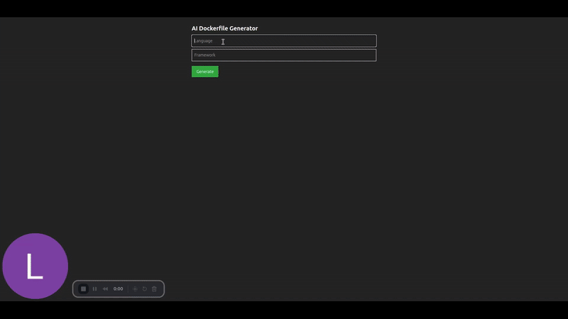

# 🐳 AI-Powered Dockerfile Generator

An intelligent developer tool that uses LLMs (Locally hosted LLaMA 3) to generate production-ready Dockerfiles based on your selected programming language and framework. It also validates the generated Dockerfile and provides options to copy, download, or lint the result.



---

## 🚀 Features

- ✅ AI-generated Dockerfiles with best practices
- ⚙️ Supports any language + framework combo (e.g., Python + Flask, JS + Express)
- 🔍 Lint/validate the Dockerfile for syntax issues
- 📥 Copy the Dockerfile
- 🌐 Modern Web UI built using React + Axios
- 💡 LLM runs locally using Ollama — no cloud APIs required!

---

## 🛠 Technologies Used

### 🔧 Backend
- FastAPI – Lightweight Python API framework
- Ollama – To run LLama 3.2:1B model locally
- Python 3.10+

### 💻 Frontend
- React.js – Modern UI
- Axios – HTTP requests to the backend
- Tailwind CSS - For styling
  
---

## ⚙️ How It Works
1. You input a language (e.g., python) and a framework (e.g., flask) into the UI.
2. The backend sends this prompt to the LLaMA 3 model via the Ollama Python SDK.
3. The model generates a Dockerfile that:
     - Uses a proper base image
     - Installs the required framework
     - Sets up working directory and commands
     - The Dockerfile is returned, saved, validated, and shown on screen.

## 🧪 How to Run This Locally
### Step 1: Install Prerequisites
- Python 3.10+
- Node.js + npm
- Ollama (install and run ollama run llama3:1b at least once)

### Step 2: Clone the repository
```bash
git clone https://github.com/your-username/ai-assisted--devops-dockerfile-generator.git
cd dockerfile-generator-ai
```

### Step 3: Backend Setup
```bash
cd backend
python -m venv venv
source venv/bin/activate  # or venv\Scripts\activate on Windows
pip install -r requirements.txt
uvicorn main:app --reload --port 8000
```

###
- Make sure you’ve already downloaded the model:
```bash
ollama run llama3:1b
```

### Step 4: Frontend Setup
```bash
cd frontend
npm install
npm run dev
```

Visit: http://localhost:5173

---

## ✨ Example Inputs
| Language     | Framework   |
|--------------|-------------|
| python       | flask       |
| javascript   | express     | 
| java         | springboot  |
| typescript   | nextjs      | 
| ruby         | rails       |


## 📌 Future Enhancements
- CI pipeline for auto-validation and tests
- Export Dockerfile directly to GitHub Gists
- Upload zipped source and auto-generate Dockerfile

## 🤝 Contributing
Pull requests are welcome. For major changes, please open an issue first to discuss what you’d like to change or improve.


Built with ❤️ by Rucha Daware
